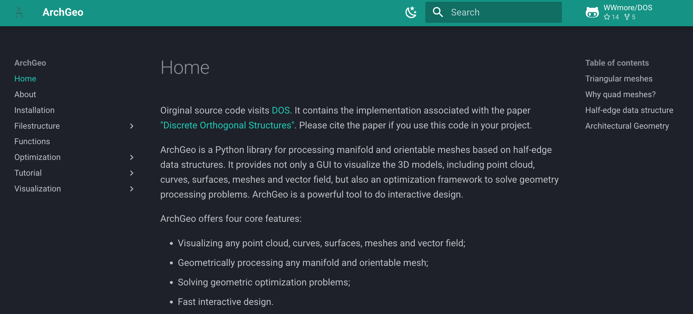

#  ArchGeo

  

ArchGeo is a Python library for processing manifold and orientable meshes based on half-edge data structures.
It provides not only a GUI to visualize the 3D models, including point cloud, curves, surfaces, meshes and vector field, but also an optimization framework to solve geometry processing problems. 
ArchGeo is a powerful tool to do interactive design.

ArchGeo offers four core features:

* Visualizing any point cloud, curves, surfaces, meshes and vector field;
* Geometrically processing any manifold and orientable mesh;
* Solving geometric optimization problems;
* Fast interactive design.

This repository contains the implementation associated with the paper ["Discrete Orthogonal Structures"](https://doi.org/10.1016/j.cag.2023.05.024). 
Please cite the paper if you use this code in your project. 

<section class="section" id="BibTeX">
  

    <h2 class="title">BibTeX</h2>
    <pre><code>@Article{DOS2023,
      author       = {Dellinger, Felix and Li, Xinye and Wang, Hui},
      title        = {Discrete Orthogonal Structures},
      journal      = {Computers & Graphics},
      volume       = {114},
      pages        = {126--137},
      month        = {June},
      year         = {2023},
      doi          = {10.1016/j.cag.2023.05.024},
      url          = {https://www.huiwang.me/projects/10_project/}
}</code></pre>
  

</section>
