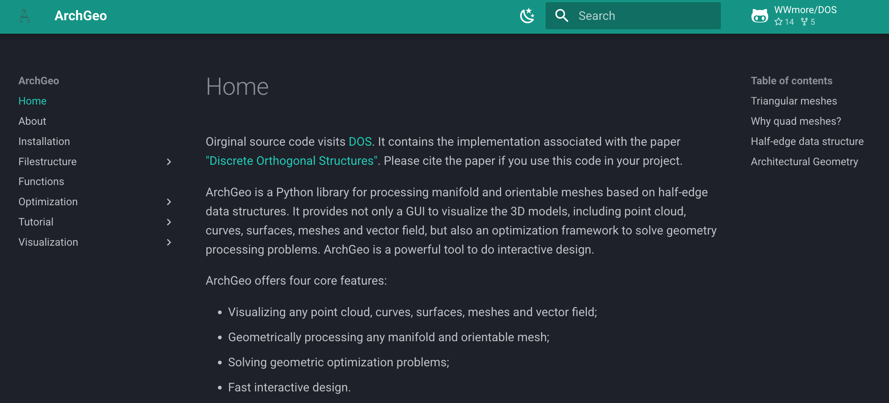

# Documentation for  ArchGeo

  

ArchGeo is a Python library designed for processing manifold and orientable meshes using half-edge data structures. It offers a comprehensive toolkit for geometric computing and interactive design. Key features of ArchGeo include:

- **Visualization**: ArchGeo provides a built-in GUI for visualizing 3D models, including point clouds, curves, surfaces, meshes, and vector fields.
- **Geometry Processing**: It supports geometric processing of manifold and orientable meshes, enabling users to manipulate and analyze complex geometric data.
- **Optimization Framework**: ArchGeo includes a robust optimization framework for solving geometry processing problems, making it a powerful tool for advanced geometric computing.
- **Interactive Design**: The library is optimized for fast interactive design, allowing users to iteratively refine their models in real-time.

The implementations of ArchGeo related to the paper ["Discrete Orthogonal Structures"](https://doi.org/10.1016/j.cag.2023.05.024). If you use this library in your projects, please cite the associated paper.

<section class="section" id="BibTeX">
  

    <h2 class="title">BibTeX</h2>
    <pre><code>@Article{DOS2023,
      author       = {Dellinger, Felix and Li, Xinye and Wang, Hui},
      title        = {Discrete Orthogonal Structures},
      journal      = {Computers & Graphics},
      volume       = {114},
      pages        = {126--137},
      month        = {June},
      year         = {2023},
      doi          = {10.1016/j.cag.2023.05.024},
      url          = {https://www.huiwang.me/projects/10_project/}
}</code></pre>
  

</section>
