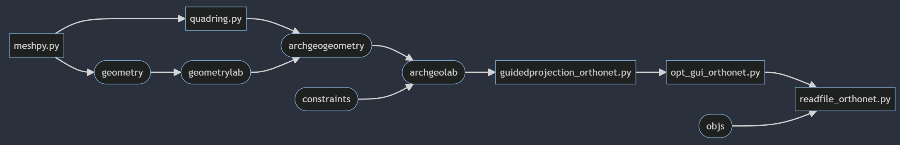

# Installation

Using Anaconda to install every package.

## Windows

    1. Download Anaconda

    2. Open Anaconda Prompt
    ```
    $ conda create -n geo 
    $ conda activate geo
    $ conda install mayavi traits traitsui qt pyqt vtk scipy spyder 
    $ conda install -c haasad pypardiso
    ```
    3. Open Anaconda, under "geo" environment open Spyder


Once above installation failed because of versions conflict, then try below installations:

    ```
    $ conda create -n geo python=3.6
    $ conda activate geo
    $ pip install numpy scipy
    $ pip install python-vtk
    $ pip install mayavi --no-cache
    $ conda install -c haasad pypardiso
    $ conda install pyface
    ```

  Or use the exported files within ```./conda/``` to set your environment

    ```
    $ conda env create -f environment.yml
    ```

## MacOS

Same as the way in Windows.


## File Structure





## Quickstart

Opening an integrated GUI window is easy. Just run the file **readfile_orthonet.py**.