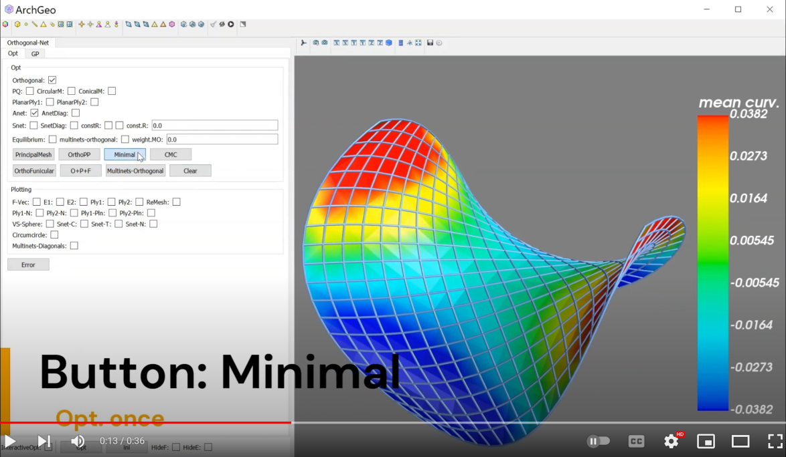

# A-net

Chinese explaination refers to the Section 3.6 in the [PhD thesis](https://www.huiwang.me/assets/pdf/hui-phd-thesis.pdf).

## Definition

**A-net** is a curve network formed by two families of asymptotic curves.
Its discretization [1] is defined by a quad mesh with all planar vertex starts, i.e. each vertex $v$ and its 4 neighbouring connected vertices $v_i(i=1,\cdots,4)$ are planar.

## Constraint

To represent the planar vertex stars, additional vertex normals $v_n$ are used as auxiliary variables.
$v_n$ should be unit normals that are orthogonal to vectors $v_i-v (i=1,\cdots,4)$:

$$
v_n ^2 = 1, v_n \cdot (v_i-v) = 0, i=1,\cdots,4.
$$

Suppose the number of vertex star of valence 4 is $|V_4|$, then the number of all variables is $|X| = 3|V| + 3|V_4|$ and the number of hard constraints is $N = |F| + 5|V_4|$.

| Variable     | Symbol       | Number             |
| ------------ | ------------ | ------------------ |
| `vertices`   | $v  \in R^3$ | $3\vert V \vert$   |
| `normals`    | $v_n\in R^3$ | $3\vert V_4 \vert$ |

<!-- | $H_A \cdot X  = r_A$  | Representation                                                                               |
| --------------------- | -------------------------------------------------------------------------------------------- |
| `$H_A$: shape`        | $(N,3\vert V \vert)$                                                                         |
| `$H_A$: row`          | np.tile(np.arange($N$),12)                                                                   |
| `$H_A$: col`          | $[col_1,col_2,col_3,col_4]$                                                                  |
| `$H_A$: data`         | $2[X_n[col_1]-X_n[col_3],X_n[col_4]-X_n[col_2],X_n[col_3]-X_n[col_1],X_n[col_2]-X_n[col_4]]$ |
| `$r_A$`               | $(X_n[col_1] - X_n[col_3])^2 - (X_n[col_2] - X_n[col_4])^2$                                  | -->

The function for the quad mesh being A-net is `DOS/archgeolab/constraints/constraints_net.py/con_anet()`,
while the function `./con_anet_diagnet()` is used for the mesh diagonal net being A-net.

## Minimal net

Orthogonal A-net is a parametrization of minimal surface [1]. 
The corresponding discretization can be defined by planar vertex stars and equal-diagonal-length quad faces.

Let the sparse matrix and the array of A-net are $H_A$ and $r_A$, respectively.
For minimal net optimization, one just stacks the sparse matrix $H$ and $H_A$, and concatenate the array $r$ and $r_A$ to the final solver.

<!--  -->

-----------------------------------------------------------

[1] Alexander Bobenko, Suris Yuri. 2008. Discrete differential geometry: Integrable structure. Vol. 98. American Mathematical Soc.

