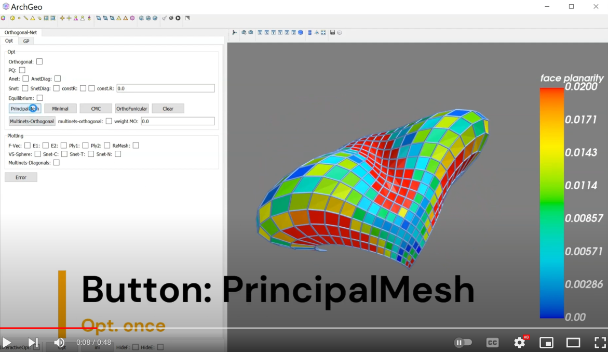

# Principal curvature net

Chinese explaination refers to the Section 3.5 in the [PhD thesis](https://www.huiwang.me/assets/pdf/hui-phd-thesis.pdf).

## Principal net

<!--  -->

-----------------------------------------------------------
[1] Alexander Bobenko, Suris Yuri. 2008. Discrete differential geometry: Integrable structure. Vol. 98. American Mathematical Soc.

[2] Yang Liu, Helmut Pottmann, Johannes Wallner, Yongliang Yang, Wenping Wang. 2006. Geometric modeling with conical meshes and developable surfaces. ACM Trans. Graphics 25, 3, 681--689.