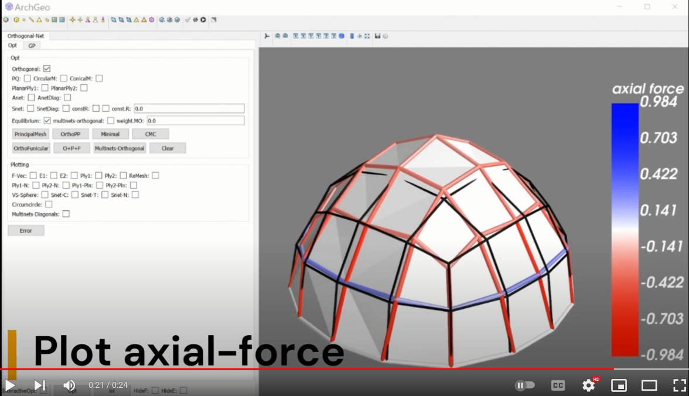

# Principal stress net

<!--  -->

-----------------------------------------------------------
[1] Martin Kilian, Davide Pellis, Johannes Wallner, Helmut Pottmann. Material-minimizing forms and structures. ACM Trans. Graphics 36,  6 (2017): 1-12.

