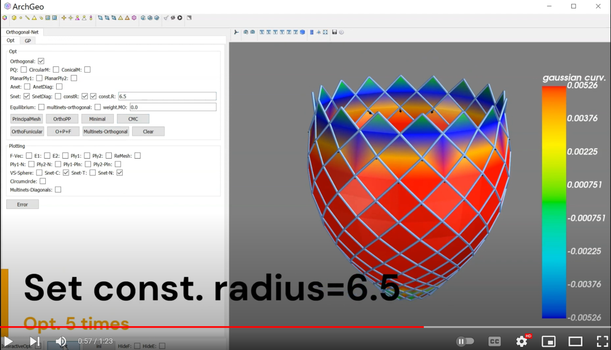

# S-net

Chinese explaination refers to the Section 3.2 in the [PhD thesis](https://www.huiwang.me/assets/pdf/hui-phd-thesis.pdf).

## Definition

**S-net** refers to principal symmetric net [1-3], whose net tangent directions at each point are symmetric with respect to the principal curvature directions of the surface.
It is a generalization of A-net and well studied in great detail in [1]. 
The discretization of S-net is a quad mesh with spherical vertex stars for all vertices of valence 4, i.e. each vertex 
$v$ and its 4 neighbouring connected vertices $v_{i},(i=1,\cdots,4)$ lie on a common sphere. 
Then the 5 vertices satisfy the quadratic equations:

$$
(v-o)^2-r^2 = 0,  (v_i - o)^2-r^2 = 0, i=1,\cdots,4
$$

where the sphere center $o$ and the radius $r$ are introduced as auxiliary variables.

<!-- 共球，则5点满足具有相同系数的二次曲面方程
\begin{equation}\label{eq:sphere}
f(v_k) = a\cdot v_k^2 + (b,c,d) \cdot v_k ^T + e = 0, (k = i, ij).
%f(x,y,z) = a\cdot(x^2+y^2+z^2)+b\cdot x+c\cdot y+d\cdot z + e = 0
\end{equation}
其对应的标准方程$(x-m_1)^2+(y-m_2)^2 + (z-m_3)^2 = r^2$的
球心坐标$m_i = (m_{i}^1, m_{i}^2, m_{i}^3) = (-\frac{b}{2a},-\frac{c}{2a},-\frac{d}{2a})$,
和半径为$r=\sqrt{b^2 + c^2 + d^2 -4 a\cdot e}/(2a)$. -->

## Constraint of S-net

Let the number of vertex star of valence 4 is $|V_4|$, then the number of all variables is $|X| = 3|V| + 4|V_4|$ and the number of hard constraints is $N = |F| + 5|V_4|$.

| Variable   | Symbol      | Number             |
| ---------- | ----------- | ------------------ |
| `vertices` | $v \in R^3$ | $3\vert V   \vert$ |
| `centers`  | $o \in R^3$ | $3\vert V_4 \vert$ |
| `radii`    | $r \in R$   | $ \vert V_4 \vert$ |

## CMC-net

CMC surface refers to surfaces of constant mean curvature, i.e. at each point the average of two extreme curvature is constant $
(\kappa_1 + \kappa_2)/2=const.$

When a S-net is an orthogonal net and the spheres at the vertex stars have constant radius $r=const.$, the net is a CMC-net.

The function of quad mesh being S-net or CMC-net is `DOS/archgeolab/constraints/constraints_net.py/con_snet()`,
while the function `./con_snet_diagnet()` is used for the diagonal net being S-net or CMC-net.

<!--  -->

-----------------------------------------------------------
[1] Davide Pellis$^1$, Hui Wang$^1$, Florian Rist, Martin Kilian, Helmut Pottmann, Christian Müller. ACM Trans. Graphics 39, 4 (2020): 127-1. 

[2] Martin Kilian, Hui Wang, Eike Schling, Jonas Schikore, Helmut Pottmann. Curved Support Structures and Meshes with Spherical Vertex Stars. ACM SIGGRAPH 2018 Posters. 

[3] Eike Schling, Martin Kilian, Hui Wang, Jonas Schikore, Helmut Pottmann. Design and Construction of Curved Support Structures with Repetitive Parameters. Proc. Advances in Architectural Geometry 2018 (AAG2018), Lars Hesselgren et al., Springer, 2018: 140-165. 