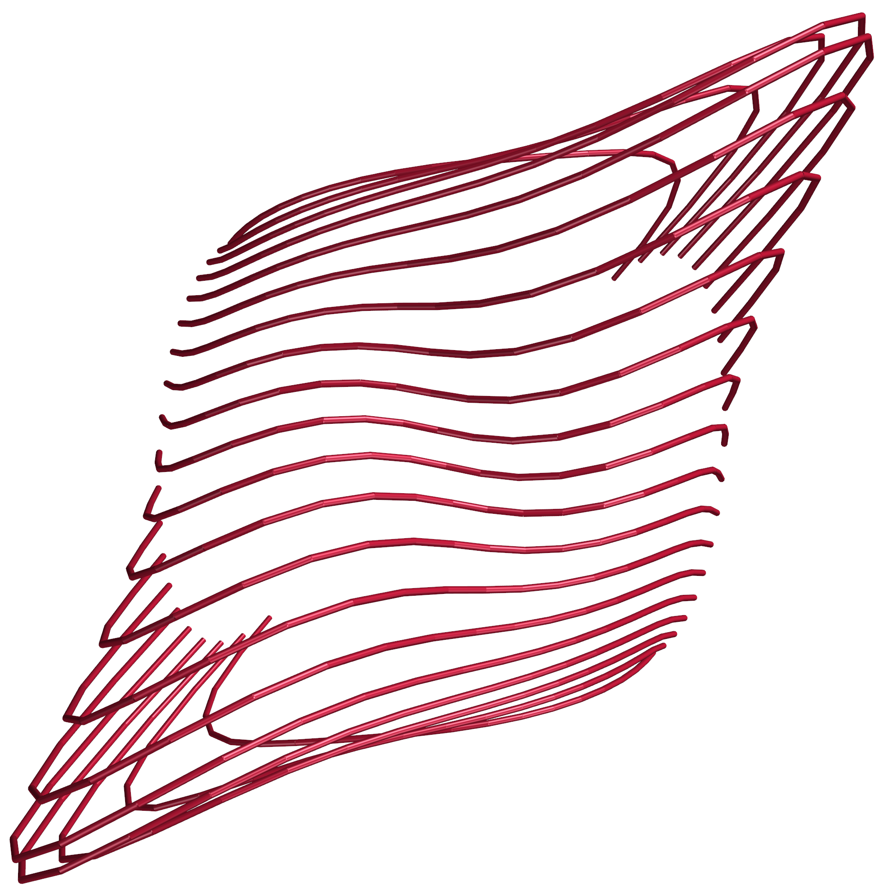

# Plot Curve

Bezier curves and B-spline curvess are the core representation of curves in Computer Aided Design area, where Bezier curves are the most simply one. 
A very nice introduction refers [here](https://alatown.com/spline-history-architecture/).
And [here](https://ciechanow.ski/curves-and-surfaces/) is a very neat and intuitive introduction with interactive parameter changes. 


## Polyline

Polylines are discrete curves. They are represented by straight segments connecting a series of points.

``` py
from geometrylab.geometry import Polyline
def plot_polyline(self, Points, name):
    poly = Polyline(Points,closed=False)  
    self.meshmanager.plot_polyline(poly,color=(162,20,47),glossy=0.8,tube_radius=1*self.meshmanager.r,name=name)
```



## Bezier Curve


TODO: insert a fig. here.


## B-spline Curve


TODO: insert a fig. here.