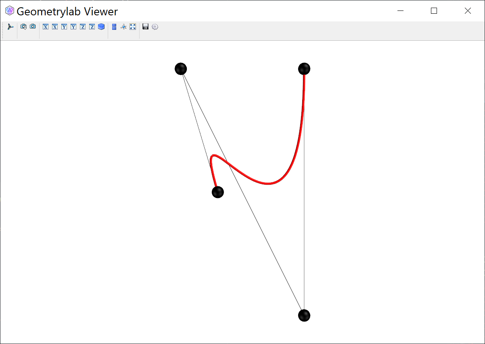
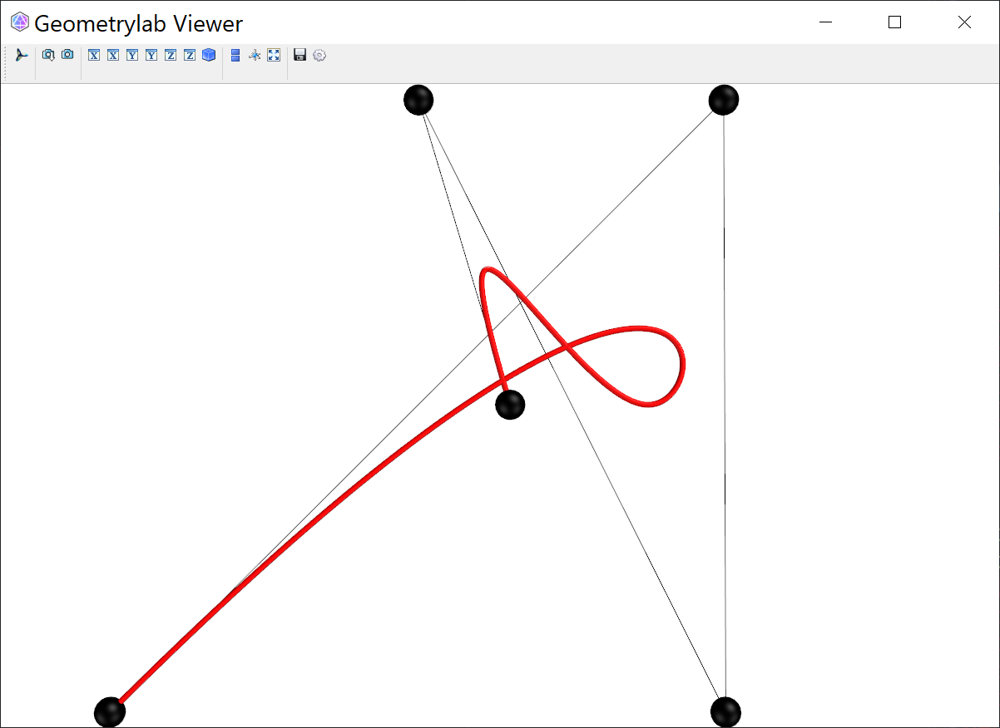

# Plot Curve

Bezier curves and B-spline curvess are the core representation of curves in Computer Aided Design area, where Bezier curves are the most simply one. 
A very nice introduction refers [here](https://alatown.com/spline-history-architecture/).
And [here](https://ciechanow.ski/curves-and-surfaces/) is a very neat and intuitive introduction with interactive parameter changes. 


## Polyline

Polylines are discrete curves. They are represented by straight segments connecting a series of points.

``` py
from geometrylab.geometry import Polyline
def plot_polyline(self, Points, name):
    poly = Polyline(Points,closed=False)  
    self.meshmanager.plot_polyline(poly,color=(162,20,47),glossy=0.8,tube_radius=1*self.meshmanager.r,name=name)
```

<figure markdown>
  { width="700" }
  <figcaption>Polylines</figcaption>
</figure>


## Bezier Curve

Plot Bezier curve of degree 3 with given 4 control points.

As seen in the file `./geometrylab/geometry/bspline.py`.

```py
## plot Bezier curve, control points and control polygon:
from geometrylab import vtkplot
from geometrylab.bspline import BSpline

P = np.array([[3,0,0], [0,10,0], [10,-10,0], [10,10,0]])
sp = BSpline(control_points=P, degree=3)

crv = sp.curve_polyline()
ctrl = sp.control_polyline()

pl_crv = vtkplot.Polyline(polyline=crv, tube_radius=0.1, color='r',sampling=500)
pl_ctrl = vtkplot.Polyline(polyline=ctrl, color='black')
pl_pts = vtkplot.Points(P, radius=0.5, color='black')

vtkplot.view([pl_pts, pl_crv, pl_ctrl])
```

<figure markdown>
  { width="700" }
  <figcaption>Bezier curve</figcaption>
</figure>


## B-spline Curve

Plot B-spline curve of degree 3 with given 5 control points. Two endpoints are interpolated.

As seen in the file `./geometrylab/geometry/bspline.py`.

```py
## plot B-spline curve, control points and control polygon:
P = np.array([[3,0,0], [0,10,0], [10,-10,0], [10,10,0], [-10,-10,0]])
sp = BSpline(control_points=P, degree=3,closed=False)

crv = sp.curve_polyline()
ctrl = sp.control_polyline()

pl_crv = vtkplot.Polyline(polyline=crv, tube_radius=0.1, color='r',sampling=500)
pl_ctrl = vtkplot.Polyline(polyline=ctrl, color='black')
pl_pts = vtkplot.Points(P, radius=0.5, color='black')

vtkplot.view([pl_pts, pl_crv, pl_ctrl])
```

<figure markdown>
  { width="700" }
  <figcaption>B-spline curve</figcaption>
</figure>


As seen in the file `./geometrylab/fitting/bspline.py`.

```py
P = np.array([[0,0,0], [0,10,0], [10,-10,0], [10,10,10], [-10,-10,0]])
sp = BSpline(control_points=P, degree=3)
#t = np.array([0.0001, 0.2, 0.4, 0.6, 0.8, 0.9, 0.99999])
t = np.random.random(200)

Pt = sp.points(t)

T, N = sp.frame(t)
pl_v = vtkplot.Vectors(T,anchor=Pt)

pl_p = vtkplot.Points(P, radius=0.3, color='black')

ctrl = Polyline(P)
pl_ctrl = vtkplot.Polyline(polyline=ctrl, color='black')

vtkplot.view([pl_p, pl_v, pl_ctrl])
```

<figure markdown>
  { width="700" }
  <figcaption>Tangent vectors of a B-spline curve</figcaption>
</figure>