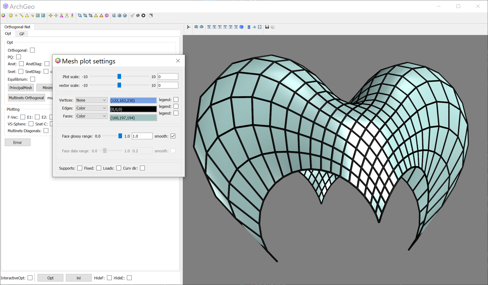
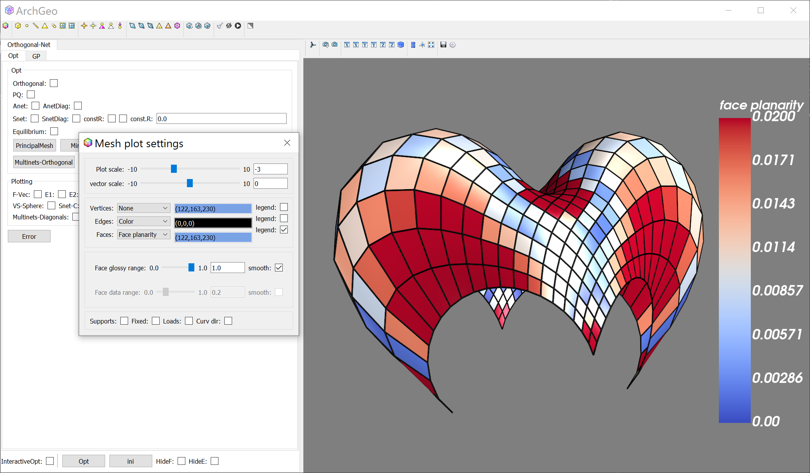
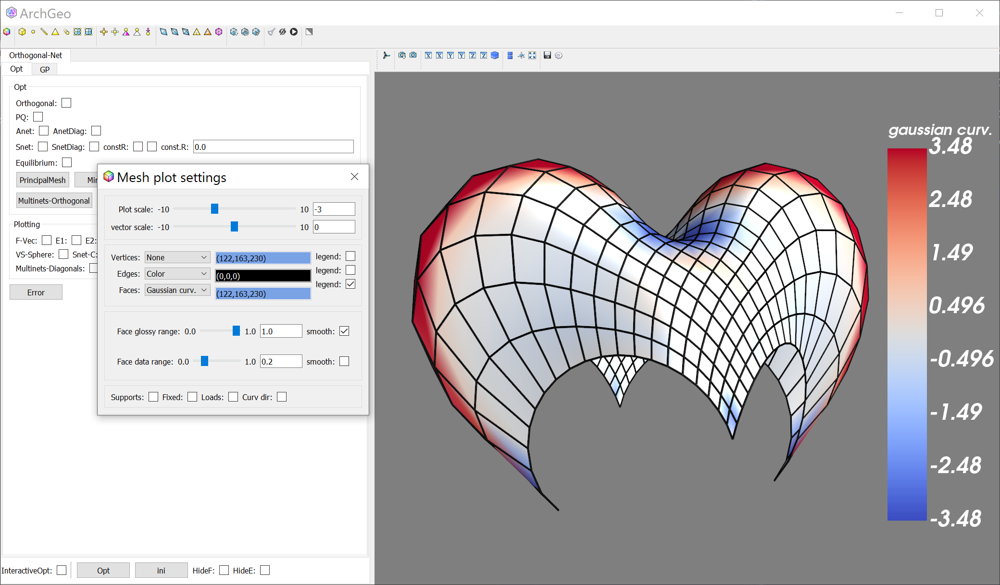
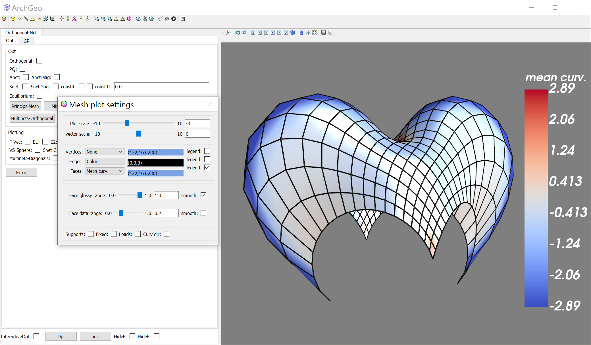
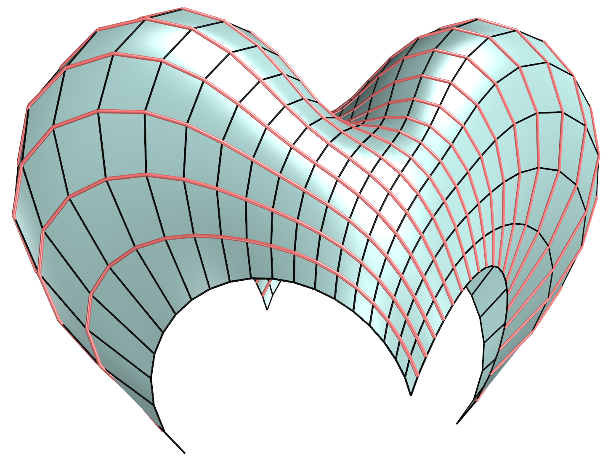
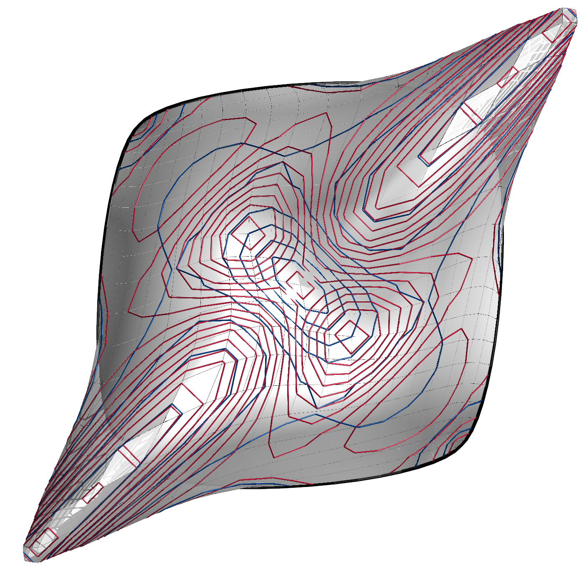
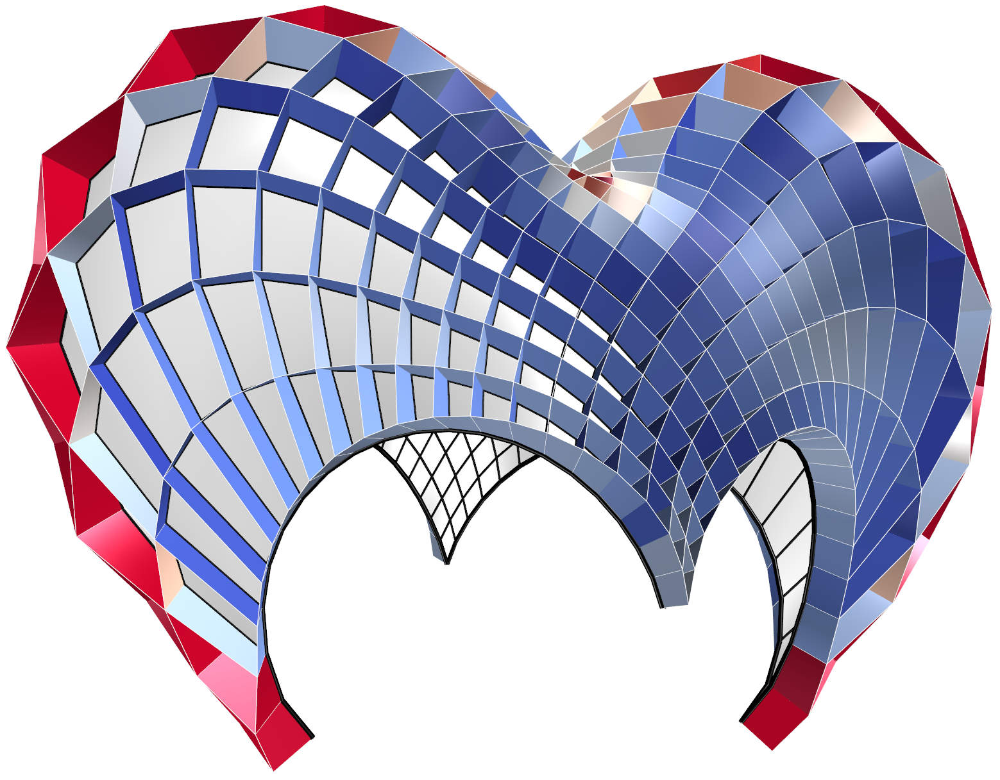

# Plot Mesh

Curves, surfaces, polyhedra are basic topics in geometry. [Here](https://paulbourke.net/geometry/) shows some interesting geometry models with visual and algebraic representaions.
[Mathcurve](https://mathcurve.com/surfaces.gb/surfaces.shtml) is a very helpful curve and surface library.

Mesh are discretized surfaces. They are represented by straight edges connecting ranges of points as vertices.


``` py
from geometrylab.vtkplot.edgesource import Edges
from geometrylab.vtkplot.facesource import Faces
def plot_mesh(self, mesh, name):
    showe = Edges(mesh,color='black',tube_radius=1*self.meshmanager.r,name=name+'e')
    showf = Faces(mesh,color=(160,197,194),glossy=1,name=name+'f')
    self.meshmanager.add([showe, showf])
```

<figure markdown>
  { width="700" }
  <figcaption>Quad mesh</figcaption>
</figure>


## Quad Planarity

```py
def plot_planarity(self, mesh, name):
    data = mesh.face_planarity()
    val = np.max(data)
    print('max. planarity =','%.2g' % val)
    showe = Edges(mesh,color='black',name=name+'e')
    showf = Faces(mesh,face_data=data,glossy=1,opacity=1,color='coolwarm',lut_range=[0,val],name=name+'f')
    self.meshmanager.add([showe, showf])
```

<figure markdown>
  { width="700" }
  <figcaption>Planarity of a quad mesh</figcaption>
</figure>


## Gaussian Curvature

```py
def plot_gaussian_curvature(self, mesh, name):
    vertex_data = mesh.gaussian_curvature()
    vertex_data = mesh.smooth_vertex_data(vertex_data)
    showe = Edges(mesh,color='black',name=name+'e')
    showf = Faces(mesh,vertex_data=vertex_data,color='coolwarm',lut_range='-:0:+',name=name+'f')
    self.meshmanager.add([showe, showf])
```

<figure markdown>
  { width="700" }
  <figcaption>Gaussian curvature of a quad mesh</figcaption>
</figure>


## Mean Curvature

```py
def plot_mean_curvature(self, mesh, name):
    vertex_data = mesh.mean_curvature()
    vertex_data = mesh.smooth_vertex_data(vertex_data)
    showe = Edges(mesh,color='black',name=name+'e')
    showf = Faces(mesh,vertex_data=vertex_data,color='coolwarm',lut_range='-:0:+',name=name+'f')
    self.meshmanager.add([showe, showf])
```

<figure markdown>
  { width="700" }
  <figcaption>Mean curvature of a quad mesh</figcaption>
</figure>


## Curve network

```py
def plot_curvenet(self, mesh, name):
    poly1 = mesh.get_both_isopolyline(True)
    poly2 = mesh.get_both_isopolyline(False)
    self.meshmanager.plot_polyline(polyline=poly1,color='black',name=name+'1')
    self.meshmanager.plot_polyline(polyline=poly2,color=(240,114,114),name=name+'2')
```

<figure markdown>
  { width="700" }
  <figcaption>Curve network of a quad mesh</figcaption>
</figure>


## Isolines

```py
def plot_isolines(self, mesh, name, w_smooth_vertex=0.1,num_contour=20):
    ## plot the isoline of Gaussian curvature K (red) and Mean curvature H (blue)
    mesh,k1,k2,K,H = mesh.get_curvature_disk_polylines(is_quad=True,is_sub=True)

    showf = Faces(mesh,color='white',opacity=0.99,name=name)
    self.meshmanager.add(showf) 

    if w_smooth_vertex!=0:
        K = mesh.smooth_vertex_data(K,smoothing=w_smooth_vertex)
        H = mesh.smooth_vertex_data(H,smoothing=w_smooth_vertex)

    showK = Faces(mesh,vertex_data=K,iso_surface=True,
                    color=(162,20,47),glossy=0.8,
                    tube_radius=3,number_of_contours=num_contour,
                    name = name+'K')

    showH = Faces(mesh,vertex_data=H,iso_surface=True,
                    color=(2,52,118),glossy=0.8,
                    tube_radius=3,number_of_contours=num_contour,
                    name = name+'H')

    self.meshmanager.add([showK, showH])
```

<figure markdown>
  { width="700" }
  <figcaption>Isolines of a quad mesh</figcaption>
</figure>


## Support Structures

```py
def plot_support_structures(self, mesh, name):
    sm = mesh.get_both_support_structures_from_edges(
                    dist=self.scale_dist_offset,
                    is_central=self.is_middle_ss,
                    diagnet=self.switch_diagnet,
                    ss1=False,ss2=False) 
    data = sm.face_planarity()
    showe = Edges(sm,color='black',name=name+'e')
    showf = Faces(sm,face_data=data,color='coolwarm',lut_range='-:0:+',name=name+'f')
    self.meshmanager.add([showe, showf])
```

<figure markdown>
  { width="700" }
  <figcaption>Support structures of a quad mesh</figcaption>
</figure>

