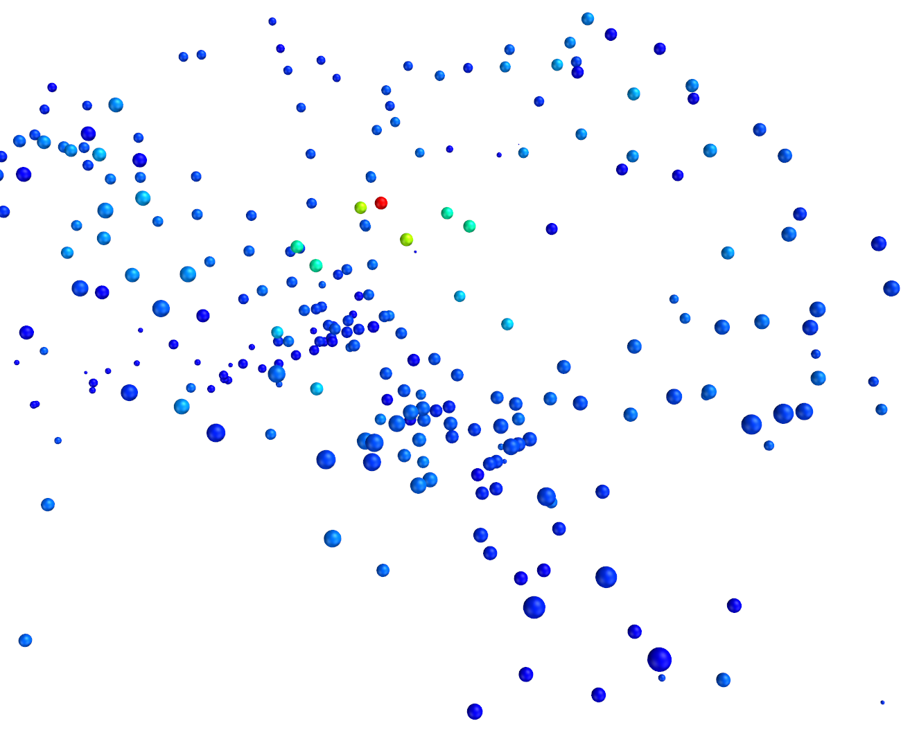
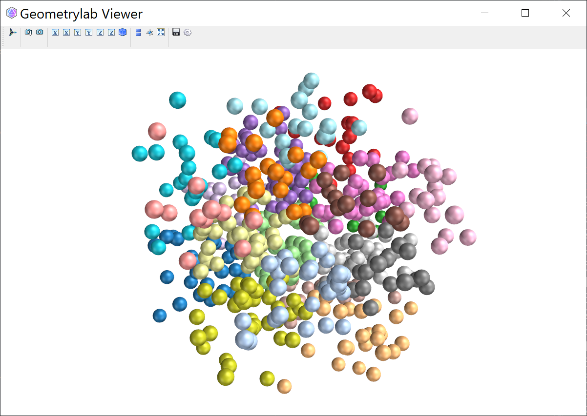

# Plot Point Cloud


#### Plot colored points
``` py
def plot_points(self, Points, name):
    self.meshmanager.plot_glyph(points=Points,color='brg',lut_range='-:0:+',radius=2*self.meshmanager.r,name=name)   
```

<figure markdown>
  { width="700" }
  <figcaption>Colored point cloud</figcaption>
</figure>


K-means cluster of point cloud as seen in the file `./geometrylab/fitting/cluster.py`.

```py
from geometrylab.vtkplot import Points, view
from geometrylab.fitting import kmeans
A = (np.random.random((500,3)) - np.random.random((500,3))) * 2
c = kmeans(A, 20)

pl = Points(A, vertex_data=c, color='Vega20', lut_range='-:+')
view([pl])
```

<figure markdown>
  { width="700" }
  <figcaption>Cluster of point cloud</figcaption>
</figure>
