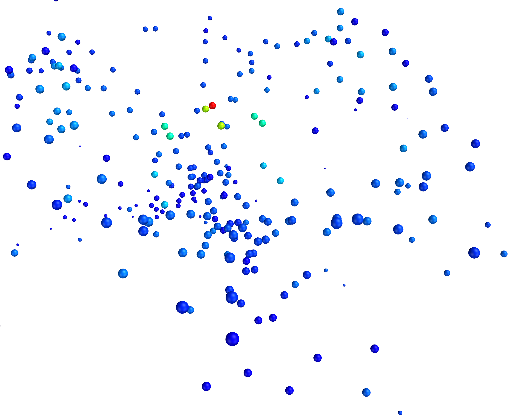

# Plot Point Cloud


#### Plot colored points
``` py
def plot_points(self, Points, name):
    self.meshmanager.plot_glyph(points=Points,color='brg',lut_range='-:0:+',radius=2*self.meshmanager.r,name=name)   
```

