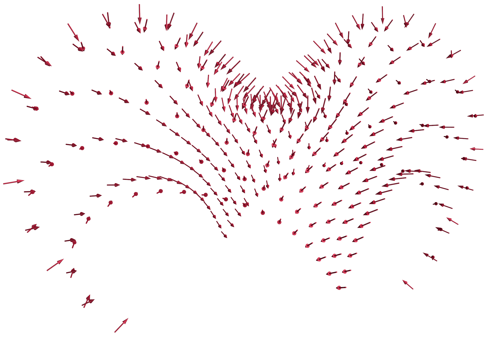

# Plot Vector Field


#### Plot vectors
```py
def plot_vectors(self, an, vn, name):
    self.meshmanager.plot_vectors(anchor=an,vectors=vn,position='tail',color=(162,20,47),name=name)  
```

<figure markdown>
  { width="700" }
  <figcaption>Vector field</figcaption>
</figure>