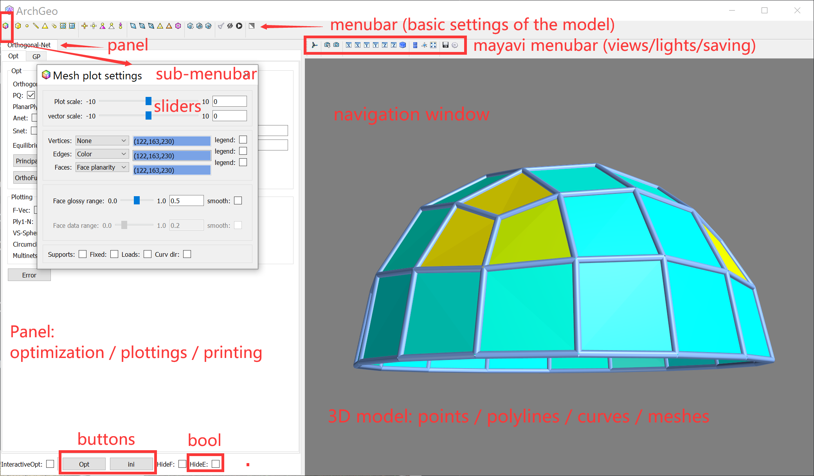

# Visualization

ArchGeo provides an interactive design GUI environment, which is based on the Mayavi library. 

## Mayavi

[Mayavi](https://docs.enthought.com/mayavi/mayavi/) is an interactive scientific data visualization and 3D plotting in Python. 
Its development is base on [TraitsUI](https://docs.enthought.com/traitsui/) and [vtk](https://vtk.org/).
Mayavi library provides Python code and example gallery of visulazation of points, curves, surfaces, meshes, vector field and animations.

## Read data

## Plot data

## Save data